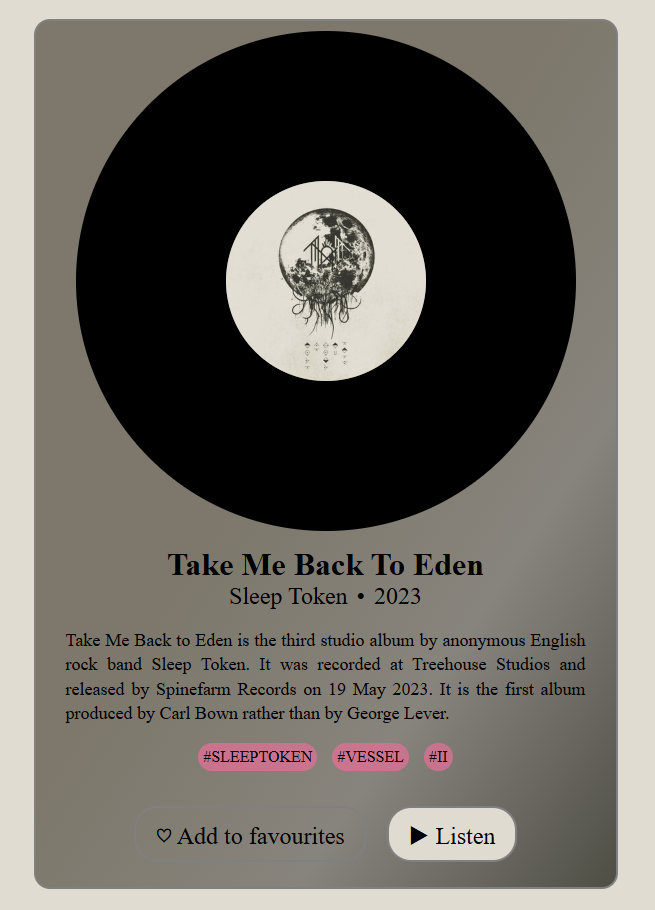

# Frontend Junior+ Roadmap

> An experiment in learning Frontend Development using AI as a mentor and learning assistant.

---


---

[🇷🇺 Russian](README.md) | 🇬🇧 English

---

## Practical Result of the First 6 Learning Phases | First Mini Project

Below is the result of completing the first six phases of the roadmap — a mini project created to reinforce the material studied.



---

## About the Project

This repository is my personal roadmap and practical knowledge base for learning Frontend Development up to a Junior+ Developer level.

The main idea behind this project is to evaluate how effectively learning can be structured using AI tools, particularly Claude Code, as:

* a mentor;
* a learning assistant;
* a roadmap generator;
* a code reviewer;
* a source of explanations and practice.

The primary goal is not simply to learn syntax, but to build a systematic understanding of Frontend Development and learn how to write high-quality production-like code.

---

# Project Goals

* Learn Frontend Development from scratch to Junior+ level.
* Build a structured learning system.
* Reinforce knowledge through practice.
* Maintain transparent learning progress.
* Build a portfolio of projects.
* Learn to work with a modern Frontend stack.

---

# Technologies and Areas of Study

## Fundamentals

* HTML5
* CSS3
* JavaScript (ES6+) — not included in the roadmap because I already know it.

## CSS Ecosystem

* Flexbox
* Grid
* Responsive Design
* Animations
* BEM
* SCSS/SASS
* Tailwind CSS

## React Ecosystem

* React
* React Hooks
* React Router
* Zustand
* Redux Toolkit
* Context API
* React Query / TanStack Query
* Form Handling
* Performance Optimization

## Tools

* Vite
* npm
* ESLint
* Prettier
* TypeScript
* DevTools

---

# Project Structure

```bash
frontend-learning-junior-plus/
│
├── roadmap/
│   ├── css/
│   ├── react/
│   └── typescript/
│
├── practice/
│   ├── html-css/
│   ├── react/
│   └── mini-projects/
│
├── projects/
│   └── album-card/
│
├── templates/
│   └── clearest-html.html
│
└── README.md
```

---

# Learning Approach

Each technology is studied using the following workflow:

1. Theory
2. Practice
3. Mini Projects
4. Revision
5. Refactoring
6. Reinforcement Through a New Project

---

# Why This Project Exists

Most roadmaps available online are either too superficial or too chaotic.

With this repository, I aim to create:

* a clear learning path;
* a structured knowledge base;
* a collection of practical exercises;
* a realistic Frontend Developer growth track.

---

# Future Plans

* Complete React Roadmap
* TypeScript
* Frontend Architecture
* API Integration
* Testing
* CI/CD
* Next.js
* Fullstack Basics

---

# Progress

## CSS

* [x] Basic Selectors
* [x] Box Model
* [x] Flexbox
* [x] Grid
* [ ] Responsive Design
* [ ] Animations
* [ ] Frameworks (soon)

## React

* [ ] Components
* [ ] Props
* [ ] State
* [ ] Hooks

---

# AI Tools Used

* Claude Code
* ChatGPT

AI is used as a supporting tool, not as a replacement for independent learning.

---

# Author

Created as part of an AI-assisted Frontend learning experiment.

* Created by Artemiy Kuznetsov

---

## License

This project is source-available.

You may view and use this code for personal and educational purposes only.

Commercial use, redistribution, sublicensing, or selling any part of this project is strictly prohibited without a separate paid license.

For commercial licensing or permissions, contact:

* Email: [artemiykuzik@gmail.com](mailto:artemiykuzik@gmail.com)
* Telegram: @LuckyRUS38

All rights reserved.
