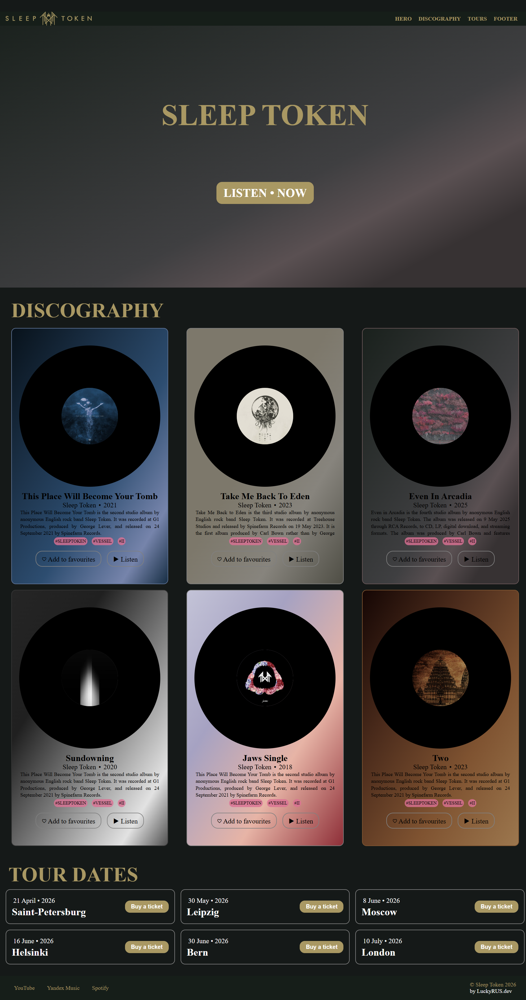

# Frontend Junior+ Roadmap

> Эксперимент по изучению Frontend-разработки с использованием AI как ментора и помощника в обучении.

---


---

🇷🇺 Russian | [🇬🇧 English](README.en.md)

---

## Второй мини-проект

Sleep Token landing page — практический результат первых 9 фаз CSS-обучения.



---

## Первый мини-проект

Результат первых 6 фаз roadmap — мини-проект для закрепления материала.


---

## О проекте

Личный roadmap и практическая база для изучения Frontend-разработки до уровня Junior+ Developer.

Эксперимент проверяет, насколько эффективно можно выстроить обучение с AI-инструментами (Claude Code) в роли наставника, ревьюера и генератора roadmap.

Цель — не синтаксис, а системное понимание Frontend и production-like код.

---

## Roadmaps

| Технология | Файл | Статус |
|---|---|---|
| CSS | [roadmap/css/css_roadmap_v2.html](roadmap/css/css_roadmap_v2.html) | В процессе |
| JavaScript | [roadmap/js/js-roadmap.html](roadmap/js/js-roadmap.html) | Не начат |
| React | [roadmap/react/react-roadmap.html](roadmap/react/react-roadmap.html) | Не начат |
| TypeScript | [roadmap/ts/ts-roadmap.html](roadmap/ts/ts-roadmap.html) | Не начат |

---

## Прогресс

### CSS
- [x] Базовые селекторы
- [x] Box Model
- [x] Flexbox
- [x] Grid
- [x] Responsive Design
- [ ] Animations
- [ ] BEM
- [ ] SCSS/SASS
- [ ] Tailwind CSS

### JavaScript
- [ ] Основы и ES6+
- [ ] DOM & Events
- [ ] Async / Promises / Fetch
- [ ] Модули

### React
- [ ] Components & Props
- [ ] State & Hooks
- [ ] React Router
- [ ] State Management (Zustand / Redux Toolkit)
- [ ] React Query / TanStack Query
- [ ] Performance Optimization

### TypeScript
- [ ] Типы и интерфейсы
- [ ] Generics
- [ ] TS + React

---

## Стек

**Основы:** HTML5 · CSS3 · JavaScript (ES6+) · TypeScript

**CSS:** Flexbox · Grid · Responsive Design · BEM · SCSS/SASS · Tailwind CSS

**React:** React · Hooks · Router · Zustand · Redux Toolkit · React Query

**Инструменты:** Vite · npm · ESLint · Prettier · DevTools · Git

---

## Структура проекта

```
frontend-learning/
│
├── roadmap/
│   ├── css/          # CSS roadmap
│   ├── js/           # JavaScript roadmap
│   ├── react/        # React roadmap
│   └── ts/           # TypeScript roadmap
│
├── practice/
│   ├── html-css/
│   ├── react/
│   └── mini-projects/
│
├── projects/
│   ├── sleep-token-landing/
│   └── album-card/
│
└── templates/
    └── clearest-html.html
```

---

## Подход к обучению

1. Теория
2. Практика
3. Мини-проект
4. Повторение и рефакторинг

---

## AI-инструменты

* **Claude Code** — основной ментор, ревьюер, генератор roadmap
* **ChatGPT** — дополнительный источник объяснений

AI используется как инструмент, а не замена самостоятельному обучению.

---

## Автор

Создано в рамках эксперимента по AI-assisted обучению.
**Artemiy Kuznetsov**

---

## License

This project is source-available. Personal and educational use only.
Commercial use strictly prohibited without a separate license.

Contact: [artemiykuzik@gmail.com](mailto:artemiykuzik@gmail.com) · Telegram: @LuckyRUS38
